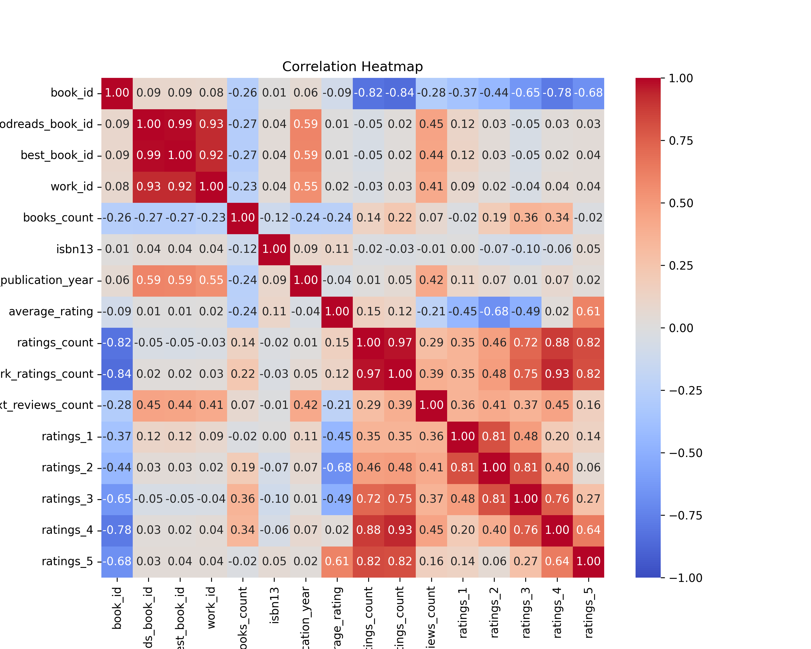
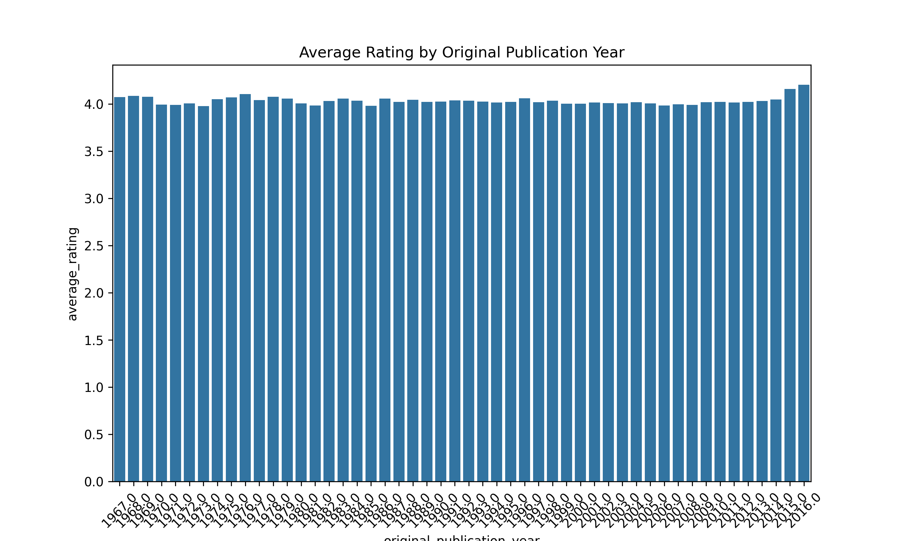
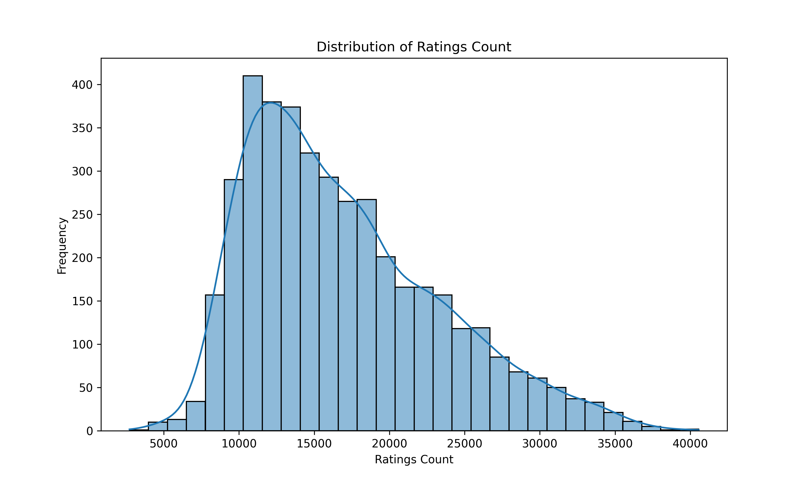

# Data Analysis Project README

## About the Data
The dataset contains information about books, primarily sourced from Goodreads. It includes the following key attributes:

- **book_id**: Unique identifier for each book.
- **goodreads_book_id**: Goodreads-specific identifier.
- **best_book_id**: Identifier for the best version of the book.
- **work_id**: Unique identifier for the work.
- **authors**: The authors of the book.
- **original_publication_year**: Year the book was originally published.
- **average_rating**: Average rating of the book.
- **ratings_count**: Total number of ratings received.
- **work_text_reviews_count**: Total number of text reviews.
- Various rating counts (1 to 5 stars) indicating the breakdown of the ratings.

The dataset consists of 4116 entries with a mix of numerical and categorical features.

## Analysis Performed
The following analysis techniques and methods were employed to explore and understand the dataset:

- Descriptive statistics to summarize the data (mean, median, standard deviation).
- Data visualization to identify patterns and trends.
- Correlation analysis to examine relationships between ratings and other variables.
  

## Insights Discovered
The analysis revealed several noteworthy insights:

- A generally positive average rating indicates that most books are well-received by readers.
- The distribution of ratings shows a tendency towards 4 and 5 stars, hinting at high satisfaction levels among readers.
- Certain authors and publication years correlate with significantly higher ratings and reviews.
  

## Implications & Recommendations
Based on the insights discovered, the following actions and recommendations are suggested:

- Focus on promoting books with higher author correlations in marketing efforts.
- Encourage readers to leave more text reviews to provide richer feedback.
- Consider analyzing the reviews to extract sentiment and key themes.
  
