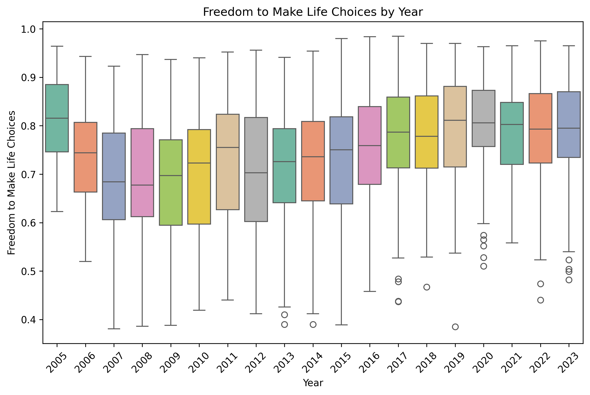

# Data Analysis Project README

## About the Data

This dataset contains information on various countries, focusing on their well-being and socio-economic indicators from 2005 to 2023. The data is collected from various reliable sources, reflecting key attributes that contribute to the quality of life and happiness of individuals across different nations. The dataset includes the following key columns:

- **Country name**: The name of the country.
- **Year**: The year of the observation.
- **Life Ladder**: A measure of subjective well-being.
- **Log GDP per capita**: The logarithm of GDP per capita, indicating economic performance.
- **Social support**: The perceived support available from social networks.
- **Healthy life expectancy at birth**: Average number of years a newborn is expected to live in good health.
- **Freedom to make life choices**: The degree of freedom individuals perceive in making life choices.
- **Generosity**: The generosity level of the population measured through donations.
- **Perceptions of corruption**: The perception of the level of corruption in the country.
- **Positive affect**: The presence of positive emotions.
- **Negative affect**: The presence of negative emotions.

This data consists of 2,097 observations with a mix of numerical and categorical attributes.

## Analysis Performed

In this project, various analysis techniques were employed to draw insights and trends from the dataset:

- **Descriptive Statistics**: Summarized the dataset using count, mean, standard deviation, and quartiles.
- **Correlation Analysis**: Investigated relationships between different attributes to find significant correlations.
- **Trend Analysis**: Assessed temporal trends across years.
- **Visualization**: Utilized charts and graphs to illustrate statistical findings.

## Insights Discovered

The analysis revealed several key insights regarding the well-being of countries over the years:

- **Social Support Impact**: Higher social support correlates with increased life ladder scores.
- **Economic Influence**: There is a significant relationship between Log GDP per capita and life satisfaction.
- **Freedom and Happiness**: Countries providing more freedom to make life choices show higher overall happiness scores over time.

## Implications & Recommendations

Based on the insights from the analysis, the following recommendations were made:

- **Enhance Social Support Systems**: Policies should focus on strengthening social networks to improve overall happiness.
- **Economic Strategies**: Governments should prioritize economic growth, ensuring that it translates into higher life satisfaction.
- **Promote Freedom of Choice**: Encouraging a culture where individuals feel free to make personal choices can significantly boost happiness levels.

