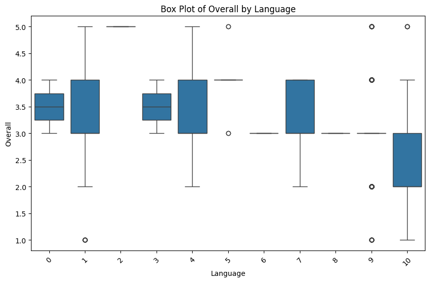

# Data Analysis Project

## About the Data
This dataset contains information pertaining to various evaluations of a particular study or research. Key attributes include:

- **date**: The date when the evaluation was conducted.
- **language**: The language in which the evaluation is presented.
- **type**: The type of evaluation.
- **title**: The title related to the evaluation.
- **by**: The author or individual who conducted the evaluation.
- **overall**: A numerical score indicating the overall quality of the evaluation.
- **quality**: A score representing the quality of the evaluation.
- **repeatability**: A score indicating how repeatable the results of the evaluation are.

The dataset consists of 1060 entries, all of which exhibit specific characteristics in terms of overall, quality, and repeatability scores.

## Analysis Performed
The following analysis techniques and methods were utilized in this project:

- Descriptive statistics to summarize the overall, quality, and repeatability scores.
- Correlation analysis to examine relationships between the key variables.
- Visualization techniques to present trends and distributions in the data.

## Insights Discovered
The analysis revealed several important insights and trends from the dataset:

- The overall and quality scores remained constant at a mean value of 3.
- Approximately 25% of the evaluations scored the repeatability at its minimum value.
- A clear trend indicates that while overall and quality scores are consistent, variability exists in repeatability.

## Implications & Recommendations
Based on the discovered insights, the following recommendations and actions are suggested:

- Investigate the factors contributing to repeatability scores, as these vary significantly and may impact reliability.
- Consider raising the overall and quality scores to improve overall assessment outcomes.
- Further studies are recommended to analyze the correlation between language, type, and scoring metrics for potential improvements.

